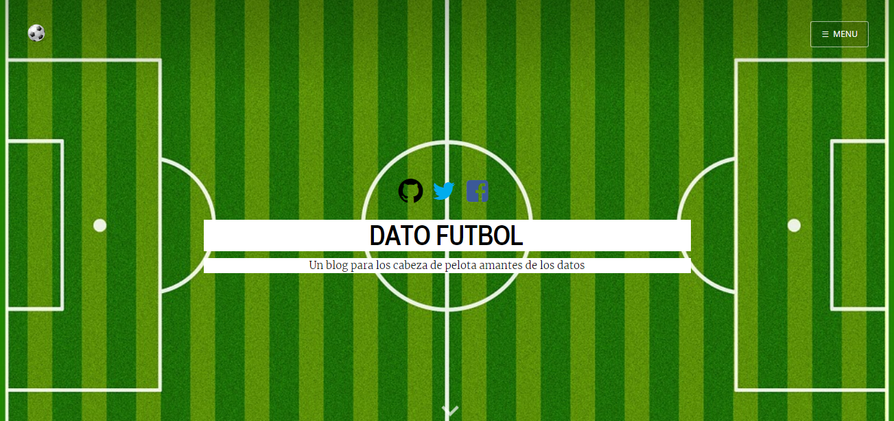
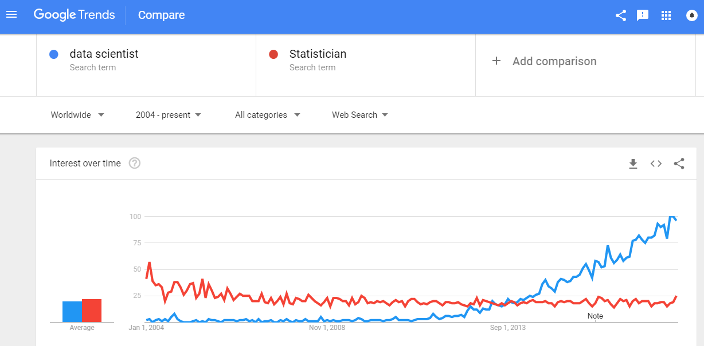
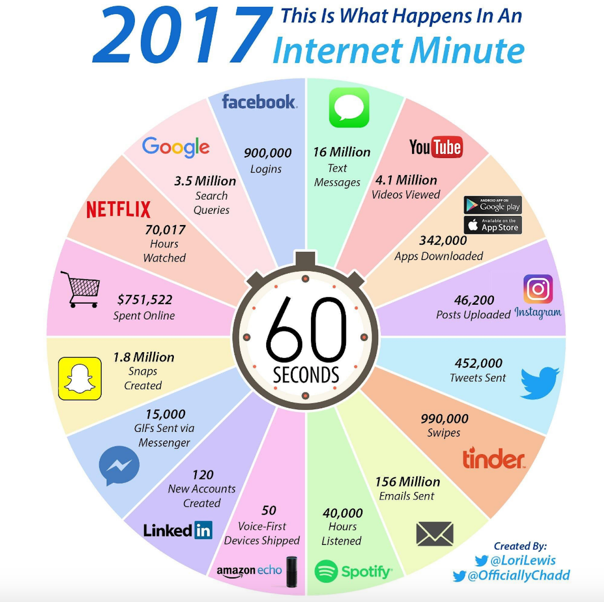
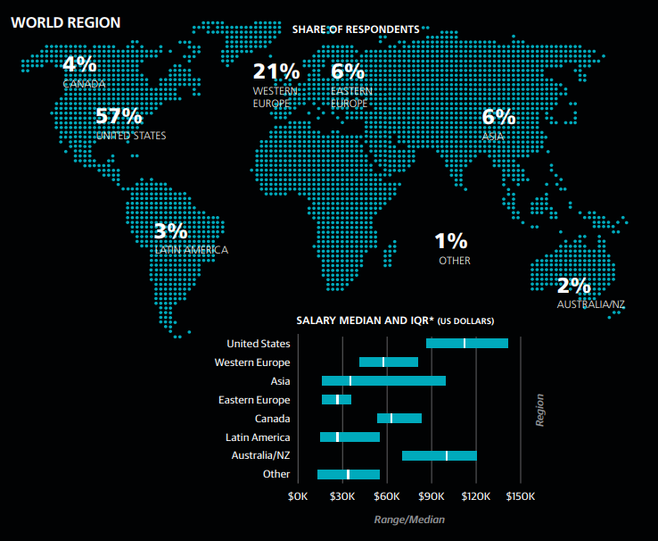
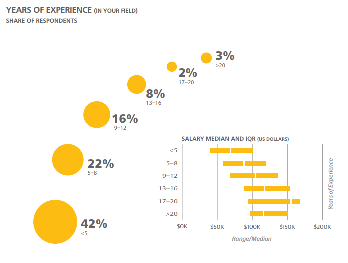
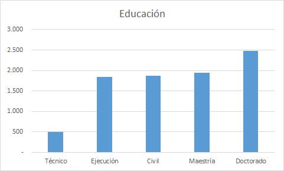
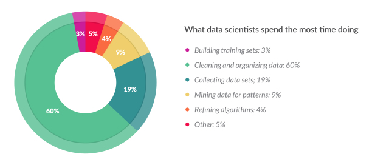

## Estructura del Taller

### 4 Sesiones

> 1. Presentación del Tema
> 2. Programación básica enfocada en Importación, Limpieza y Proceso de datos
> 3. Estadística descriptiva, Análisis exploratorio y Visualización de datos
> 4. Probabilidades + Regresión lineal + (?) y Reporte de datos

--- 
## Objetivos

> - Presentar una intro. a la Ciencia de Datos a través de un recorrido general por sus principales aspectos teóricos y prácticos

> - Describir el flujo de trabajo típico de un profesional que se dedica a la Ciencia de Datos

> - Mencionar las principales herramientas utilizadas y profundizar en el uso práctico de R y RStudio
 
> - Revisar los distintos tipos de datos y explicar los fundamentos para su orden, proceso, visualización y reporte

> - Compartir variados recursos de aprendizaje y aplicar lo aprendido en el taller

--- .segue bg:#3182bd
## Bueno, pero... ¿quién facilita el taller?

--- &twocol w1:50% w2:50%
## Ismael Gómez

*** =left

*** =right

---
## Contenido de Sesión 1
### Parte I
> - ¿Qué es la Ciencia de Datos? ¿Qué es el Big Data?

> - Contexto histórico/tecnológico

> - Perfil del científico de datos

> - Flujo de trabajo típico

> - Presentación de distintos recursos de información 

### Parte II
> - Tipos de datos y ejemplos de bases de datos

> - Herramientas típicas en Ciencia de Datos

> - Instalación y configuración de R y RStudio

--- bg:black
## ¿Qué es la Ciencia de Datos?
<a href="https://hbr.org/2012/10/data-scientist-the-sexiest-job-of-the-21st-century">

</a>

--- bg: black
## Aumento de la demanda

---
## Aumento de la demanda

---
## Aumento de la demanda

--- .segue bg:#9e9ac8
## ¿Por qué?

--- &vcenter
## "Diluvio de datos"
<a href="https://www.economist.com/node/15579717">

</a>

--- &vcenter
## Diluvio de datos

---
## Primero: Entender las escalas de tamaño para datos

---
## Crecimiento exponencial de datos

--- 
## Nos escapamos de la escala humana

--- 
## ¿Big Data?

--- .segue bg:#636363
## Big data o Small data? 

(You need `the right data`!)

--- .segue bg:#66c2a4
## Perfil del Data Scientist

---
## Interdisciplinario: Múltiples skills

--- bg:black
## No necesariamente hay que ser Data Scientist

--- 

--- &vcenter

---
## Tener en cuenta (1)
*sacado desde slides Diplomado Data Science UDD

> - Programación: Iterar. Experimentar. Pensar Computacionalmente. Manejar múltiples herramientas. Generar procesos `reproducibles`.

> - Matemáticas + Estadística -> `Formalidad en procesos`: Entender cuándo un modelo es mejor que otro. Cuándo es necesario usar regresión, clasificación, o clustering. Los tamaños de muestra necesarios. Identificar de sesgos en los datos.

> - Comunicación: Hay que saber escuchar lo que les demás tienen que decir. Comprender y adoptar su lenguaje. `No se está resolviendo un problema propio sino el de alguien más`. Hay que saber expresar y explicar los resultados obtenidos.

--- 
## "El trabajo más sexy del siglo XXI"

> - `Alta demanda`

> - Desafiante, entretenido y "poder" para influir = `Satisfacción personal`

> - Múltiples skills: Difícil de encontrar = `Altos sueldos`

--- bg:black
## Sueldos en el mundo

--- bg:black

--- &twocol w1:50% w2:50%

*** =left

*** =right

--- &twocol w1:50% w2:50%
## Sueldos Chile

*** =left

*** =right

--- .segue bg:indigo
## Entonces ¿Qué es Ciencia de Datos?

--- &twocol w1:50% w2:50%
*** =left
> - La Ciencia de Datos es un `nuevo campo interdisciplinario` que abarca y sintetiza un
número de disciplinas relevantes y campos de conocimiento, incluyendo estadística,
informática, computación, comunicación, administración y sociología, `para estudiar
datos a través de un proceso conocido como “pensamiento de ciencia de datos”`.

*** =right
> - Hay un enfoque en un entendimiento sistemático de datos complejos y problemas
aplicados. La DS aborda estos problemas a través de `un proceso que transforma datos en
“insights” e inteligencia que apoya la toma de decisiones`.
Hablamos de problemas que antes no existían, o que no se podían resolver, o bien cuyas
soluciones no eran satisfactorias, o que antes eran más sencillos que ahora y, al volverse
más complejos, los métodos tradicionales no son adecuados.

https://cacm.acm.org/magazines/2017/8/219605-data-science/fulltext

--- 
## Tener en cuenta (2)
*sacado desde slides Diplomado Data Science UDD

Data Science cubre muchas áreas. Una persona que tenga las tres habilidades
descritas no es suficiente (ni frecuente). Data Science resuelve problemas a
través de un proceso que se aborda en equipo. Se necesita un equipo diverso en género,
experiencias, habilidades, contextos, ambiciones.

--- .segue bg:black
## ¿ Y cómo se hace?

--- %vcenter
## Flujo de trabajo típico 

--- &vcenter

--- &vcenter

--- &vcenter
## Distribución del tiempo

--- .segue bg:#2b323f
## Recursos de información

---
## Comunidades + E-learning en el Extranjero
- https://www.kdnuggets.com
- https://www.analyticsvidhya.com
- https://www.kaggle.com
- https://www.oreilly.com
- http://www.fivethirtyeight.com
- https://www.springboard.com/
- https://www.coursera.org
- http://swirlstats.com
- https://www.datacamp.com
- https://stackoverflow.com
- https://quora.com
- https://towardsdatascience.com

--- 
## Comunidades + Aprendizaje en Chile

- https://www.facebook.com/groups/big.data.science.chile/
- Meetups en Santiago: [Usuarios de R](https://www.meetup.com/es-ES/useRchile), [Data Visualization](https://www.meetup.com/es-ES/Santiago-Data-Visualization), [Machine Learning](https://www.meetup.com/es-ES/Santiago-Machine-Learning-Meetup/)
- https://github.com/robsalasco/data_science_chile
- http://ingenieria.udd.cl/ver-diplomado/diplomado-en-data-science/#presentacion
- http://diplomadosycursos.uc.cl/27644-ficha-nuevo-diplomado-en-data-science
- https://www.dcc.uchile.cl/node/1681
- https://datagramas.cl
- https://datofutbol.cl

--- 
## ¿Dónde encontrar datos?
- http://www.worlddata.io
- https://www.drivendata.org
- http://snap.stanford.edu/data/
- https://archive.ics.uci.edu/ml/datasets.html
- https://opendata.socrata.com
- https://www.reddit.com/r/datasets/
- https://www.springboard.com/blog/free-public-data-sets-data-science-project/

--- 
## ¿Dónde encontrar datos? (Chile)

- https://datachile.io
- http://datos.gob.cl/
- https://datosabiertos.cl/
- http://datos.bcn.cl/es/
- http://datosabiertos.chilecompra.cl/home
- http://opendata.congreso.cl/ 
- http://www.consejotransparencia.cl/.../2012.../130034.html
- https://www.camara.cl/camara/opendata.aspx
- http://www.startupchile.org/industries/open-data/
- http://energiaabierta.cl/

--- bg:black
## Artículos complementarios 

- [Cómo convertirse en Data Scientist y no morir en el intento](https://medium.com/@carnby/cómo-ser-data-scientist-y-no-morir-en-el-intento-parte-1-8aba93d91152)

- [What is Data Science? 24 Fundamental Articles Answering This Question](http://houseofbots.com/news-detail/2283-4-what-is-data-science-24-fundamental-articles-answering-this-question)

- [The best stats you've ever seen](https://www.ted.com/talks/hans_rosling_shows_the_best_stats_you_ve_ever_seen) (Video)

--- .segue bg:#993404
## Ahora ustedes

--- 
> - ¿Por qué tomaron el curso? ¿Qué expectativas tienen de él?

> - ¿Cuál es su background? ¿De dónde vienen? ¿Qué ya saben? ¿Les interesa algún tema en particular?

> - ¿Saben programar?
