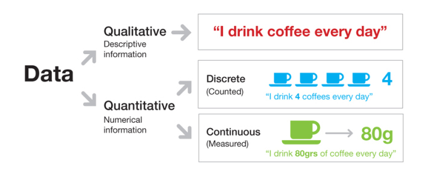

## ¿Qué es un dato?

> - Es el objeto virtual mínimo o básico: `"el átomo virtual"`

> - No es suficiente con el dato, se requiere el metadato: `dato + metadato = información`.

> - 

---
## ¿Qué es un dato?

> - Distinción entre `Estructurado` (Tablas, Bases de datos) y `No estructurado` (Texto, Video, Audio, Redes, etc).
  
> - 

> - `"Hay tanta basura como dato"`
  
> - Problema o paradoja de siempre: `"los datos no están"` (o al menos no como nos gustaría)

> - Los datos son lo 2do más importante. ¿Lo más importante? `La pregunta!`

--- .segue bg:indigo
## ¿Qué tipos de datos hay?

--- 
## Principales tipos y/o estructuras de datos

> - Numéricos

> - Caracteres (Texto)

> - Booleanos (TRUE, FALSE, NULL)

> - Temporales (Fecha, Hora, Intervalos)

> - Arreglos (Cadenas, listas, diccionarios, árboles)

> - Otros (info geográfica, codificaciones protocolares, arreglos específicos, etc.)

--- 
## Clasificación según tipo de atributo

---
## Otras clasificaciones de datos

### Algunos formatos de documentos que contienen datos

> - TXT, CSV
> - XLS
> - DOC, PDF
> - XML, HTML, JSON
> - PNG, JPG, WAV, MP3, AVI, MPG

---
## Herramientas necesarias en Ciencias de Datos

> - Herramientas para `gestión de datos` (almacenamiento y acceso a bases de datos, procesamiento distribuido, etc.)

> - Herramientas para `edición de datos` (orden, filtro, limpieza, particionamiento): `Preproceso`

> - Softwares para `modelamiento de datos` (Estadística, Minería de Datos, Machine Learning, etc.)

> - Softwares para `visualización y/o publicación de datos` (Graficar, Diseñar tableros, Interactividad, Estética, Reproducibilidad, etc.)

> - Softwares con un entorno de desarrollo integrado (IDE) con "todo" incluido: `IDE de R (RStudio)` y Python (PyCharm).

--- .segue bg:#045a8d
## ¿Por qué R?

--- bg:black
## ¿Por qué R?

> - Es `uno de los 3 lenguajes más usados en Data Science` [Muy usado por la comunidad científica (Academia), incluido en los requisitos de trabajos]                                                                                                                                                                                                                    

---
## ¿Por qué R?

> - Tiene una `comunidad enorme` de desarrolladores y usuarios (sus librerías aumentan cada día)

> - Es `gratis`

> - Con RStudio es posible `integrar en un solo entorno de trabajo la mayoría de las tareas necesarias` del workflow o pipeline de Data Science

> - [Data Analysts Captivated by R’s Power](http://www.nytimes.com/2009/01/07/technology/business-computing/07program.html?pagewanted=all)

---
## Descarga e Instalación de R y RStudio

> - [Descarga de R](https://www.r-project.org) para Windows. Versión 3.4.4 en abril 2018.

> - [Descarga de R Studio Desktop](https://www.rstudio.com) Open Source License, para Windows. Versión 1.1.442 en abril 2018.

> - Instalar R y luego R Studio en su disco duro (C:)

---
## Propuestas de datasets

> - Survival of passengers on the [Titanic](http://stat.ethz.ch/R-manual/R-devel/library/datasets/html/Titanic.html)

> - [Iris dataset](https://archive.ics.uci.edu/ml/datasets/iris)

> - [Boston housing](https://www.kaggle.com/c/boston-housing)

> - [Nombres en USA](https://bigquery.cloud.google.com/table/bigquery-public-data:usa_names.usa_1910_current?pli=1)

> - Un montón de datos en el sitio [Data Chile](https://es.datachile.io/about/data)

> - Fútbol ([Kaggle](https://www.kaggle.com/hugomathien/soccer), Copa Libertadores, Clasificatorias Conmebol u otro en [datofutbol](www.datofutbol.cl))

> - ¿Otro?

--- bg:black &vcenter 

