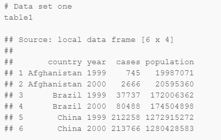
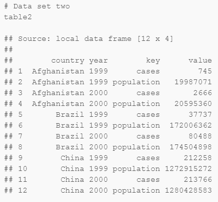
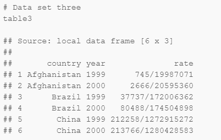
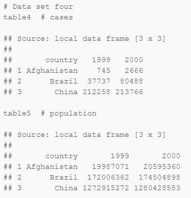
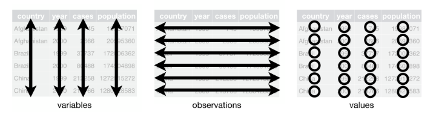

<style>
.title-slide {
  background-color: white; 
}

.title-slide hgroup > h1{
 font-family: 'Oswald', 'Helvetica', sanserif; 
}

.title-slide hgroup > h1{
  color: black;
}

.title-slide hgroup > h2 {
  color: #3182bd;
}

.title-slide hgroup > p {
  color: #2b323f;
}
</style>

## Contenido de Sesión 2
  
<center></center>

> - Importación de datos en R Studio

> - Concepto de Tidy Data

> - Criterios y ejemplos de uso de librerías/funciones para proceso de datos en R Studio

> - El proceso de datos lo separaremos en 3 etapas: `revisión, limpieza/extracción y creación/transformación`

--- 
## Importando .CSV

Usaremos el archivo CSV con los datos de clasificatorias mundialistas Conmebol entre 1998 y 2014 como ejemplo. [Descargar acá](https://1drv.ms/u/s!Av711V0Z9tyUhu8_wgnZVukywNPzdA).


```r
data <- read.csv(file='clasif_conmebol_9814.csv', header=T, stringsAsFactors=F, encoding='utf8')
```

> - No olvidar incluir correctamente la ruta del archivo. Se sugiere tenerlo en el mismo `Work Directory`.

> - En `Help` o con "`?Nombrefuncion`" es posible ver los detalles de cada función.

---
## Funciones básicas para Revisión


```r
names(data) # Para ver los nombres de las columnas
str(data)   # Para ver el tipo o la clase del objeto y de sus atributos
dim(data)   # Para ver las dimensiones de la tabla (filas y columnas)
head(data)  # Para ver las primeras X filas del objeto
tail(data)  # Para ver las últimas X filas del objeto
```

> - El operador `$` nos permite elegir una columna específica por su nombre. Ejemplo: 
`data$Equipo`

> - También se pueden seleccionar filas y columnas específicas con la notación que utiliza `[]`, `:`, `-` y `c()`.

> - Ejemplo 1: Cambiar nombre de columnas

> - Ejemplo 2: Crear nuevos atributos

--- 
## Importando .TXT

Usaremos el archivo TXT con datos de IMDB acerca de películas. [Descargar acá](https://1drv.ms/f/s!Av711V0Z9tyUhu16kJWdiHd4zU5Edg).


```r
data2 <- read.table('movies.txt', header=TRUE)
```

> - Ejemplo 3: Cómo subseleccionar o filtrar datos específicos: `&`, `|`, `==`

> - Ejemplo 4: Ordenar datos según valores de atributos con función `order()`

--- 
## Importando .XLS o .XLSX

* Usaremos un archivo XLSX con datos de mediciones de ruido de fondo diurnas y nocturnas en sectores rurales del sur de Chile. [Descargar acá](https://1drv.ms/x/s!Av711V0Z9tyUhu9ADYlRJqmbbbZQUQ).

* Para importar este tipo de archivos es necesario instalar y cargar una librería específica:


```r
 #install.packages('readxl')
 library(readxl)

 data3_h1 <- read_excel('datos_ruido_y_viento.xlsx', sheet=1)
 data3_h2 <- read_excel('datos_ruido_y_viento.xlsx', sheet=2)

 # Probar parámetros "skip", "n_max" y "range"
```

> - Ejemplo 5: Completar datos de columna Proyecto

> - Ejemplo 6: Uso de funciones `summary()` y `table()`


--- bg:white
## Otras librerías
* `openxlsx` es otra para .XLSX (buen rendmiento para archivos grandes)
* `pdftools` y `tabulizer` para .PDF
* `foreign` para .DBF y otras bases de datos
* `RSQLite` para conectarse a databases
* `qpcR` para .HTML y .XML


---
## Librería devtools

* Permite importar librerías no oficiales de [CRAN](https://cran.r-project.org) desde otras fuentes, como por ejemplo Github.

* Son desarrolladas por la comunidad y `muchas veces son sumamente útiles`.


```r
 #install.packages('devtools')
 library(devtools)
 #install_github("DeveloperName/PackageName")
```


---
## Más funciones para Revisión


```r
 nrow(data); ncol(data)  # Número de filas y número de columnas
 length(data)            # Largo de un vector o elemento
 nchar(data[1,1])        # Número de caracteres de un elemento
```

> - Ejemplo 7: Obtener la cantidad de `casos completos` y de `NA` de algún atributo. Funciones `complete.cases()` & `is.na()`

> - Ejemplo 8: Obtener los valores o nombres únicos de algún atributo. Función `unique()`


--- 
## Funciones para Limpieza de datos
# Limpieza de texto (1)


```r
 substr(data3_h1$hora, 12, 19)  # Seleccionar caracteres específicos de un string
 gsub('Vivienda', 'Edificación', data3_h1[, 3]) # Reemplazar texto por otro texto
 grep('', data)                    # Para encontrar string que cumplen una regex 
 #(como el gsub pero sin reemplazar)
 
 tolower(data)       # Convertir todo a minúsculas
 toupper(data)       # Convertir todo a mayúsculas
 trimws(data)        # Para borrar espacios
```

> - Para aprender más de expresiones regulares en R ir [acá](http://stat.ethz.ch/R-manual/R-devel/library/base/html/regex.html)

> - Ejemplo 9: Extraer la cantidad de pisos de las edificaciones

> - Ejemplo 10: Buscar todas las películas que tienen la palabra 'time' en su nombre o título 

--- 
## Funciones para Limpieza de datos
# Limpieza de texto (2)


```r
 library(stringr)    # Para más funciones
 library(stringdist) # Para búsqueda por similitud, match de textos. 
 # La función 'amatch()' es muy útil
 
 paste()       # Para concatenar caracteres
 formatC('')   # Para setear strings con longitud fija. Ej: Días con dos dígitos.
```


--- 
## Funciones para Limpieza de datos
# Filtrar y/o subseleccionar


```r
 which(data>0) # Para obtener la ubicación (fila, índice, etc.) de los datos que cumplen 
# uno o más criterios. También se usa which.max() y which.min()

 library(dplyr)
 subset(data, Pts > mean(Pts) & Pos.>=5, select=c(Equipo, Pts, Pos., Clasif)) 
# Para subseleccionar filas según algún criterio y las columnas específicas
 filter(data) # Para filtrar por múltiples criterios

# bonus de la librería:
arrange(data) # Para ordenar los datos según varios niveles, parámetro desc() para descendente
mutate(data) # Para crear nuevos atributos
```

> - Ejemplo 11: Crear un nuevo data frame que contenga únicamente las películas desde la década del 90 en adelante y que tengan un rating mayor a la mediana del mismo, sin incluir los atributos 'r'. Luego ordenarlas por año y ranking, de manera descendente.

--- 
## Funciones para Transformación de datos
# Convertir tipos de variables u objetos


```r
as.numeric()        # Para convertir a variable numérica
as.character()      # Para convertir a caracter
as.data.frame(data) # Para convertir a data frame
as.factor(data$Equipo)     # Para convertir a factor (variable categórica)

### as.Date        # Para convertir a objeto de Fecha

# Sys.time()
# Sys.Date()
# Sys.timezone()  # Chile/Continental
```

> - Ejemplo 12: Asumir que todas las películas se crearon el primero de enero del año indicado para crear una nueva variable fecha con el formato '%Y-%m-%d' (para ver detalles de formatos [acá](https://stat.ethz.ch/R-manual/R-devel/library/base/html/strptime.html))

> - Ejemplo 13: Calcular cuántas mediciones se hicieron en días de semana (lun-vier) y cuántas en días de fin de semana (diurnas y nocturnas). Función `weekdays()`.

---
## Funciones para Transformación de datos
# Más Fechas!!


```r
library(lubridate)
#year()
#month()
#day()

library(zoo)
#as.yearmon()

# Sys.getlocale("LC_TIME")
# Sys.setlocale("LC_TIME", "English") 
```

--- .segue bg:darkblue
## Tidy Data

--- 
## Tidy data

> -  Se trata de criterios de estructuración de datasets tabulares para facilitar su proceso y análisis. Propuesto por Hadley Wickham, el gurú de R. [Acá el paper](http://vita.had.co.nz/papers/tidy-data.pdf).

> - Las reglas son:

  > - 1) Cada atributo o variable debe formar una columna
  > - 2) Cada observación, muestra o ejemplo debe formar una fila
  > - 3) Cada tipo de "unidad de observación" debe formar una sola tabla.
  > - 4)* Cada valor debe estar en su propia celda

--- &twocol w1:50% w2:50%
## Tidy data

*** =left
> - <center></center>
> - <center></center>

*** =right
> - <center></center>
> - <center></center>

--- 
## Tidy data
# La tabla 1 es la única que cumple los criterios

<center></center>

---
## Más funciones para Transformación de datos

* `cbind()` y `rbind()` # Para unir columnas y filas de distintos elementos
* `merge()`             # Para hacer `joins` de bases de datos relacionales
* `cut()`               # Para segmentar una variable numérica en categorías
* `rep()`               # Para definir repitición patrones
* `seq()`               # Para crear secuencias
* `apply()`             # Para aplicar una función a columnas y filas específicas de un elemento
* `reshape()`           # Para convertir filas en columnas y viceversa. Formato ancho o largo
* `library(data.table)` # Muchas utilidades

> - Ejemplo 14: Unir las mediciones diurnas y nocturnas en un solo data frame

> - Ejemplo 15: Descargar los datos de sobrevivientes del Titanic [acá](https://1drv.ms/u/s!Av711V0Z9tyUhu9Dz6Zqzehp3c-YXA) para luego crear grupos de edades de los pasajeros con intervalos cada 10 años.

---
## Programación tradicional
# Sentencias `if`


```r
if(1>0)
{
        
}

# if.else()
```

---
## Programación tradicional
# Ciclos `for`


```r
for (i in 1:10)
{
        
}
```

--- 
## Bonus track: scraping de .HTML "simple"


```r
  #install.packages('rvest')
  library(rvest)
```

> - Ejemplo 16: Usar al menos una sentencia `if` y un ciclo `for` para scrapear las tablas de posiciones de las fases de grupos de Copa Libertadores entre 2011 y 2017 desde el sitio web de [ESPN](http://www.espn.cl/futbol/posiciones/_/liga/conmebol.libertadores/season/)

---
## Programación tradicional
# Funciones propias


```r
mi_funcion <- function(input1=0, input2=0)
              {
                salida <- input1 + input2
                salida
              }
```

---
## Exportación a .CSV

```r
 # write.csv(data, 'data.csv', row.names=F)

 # remove()
```
