<style>
.title-slide {
  background-color: white; 
}

.title-slide hgroup > h1{
 font-family: 'Oswald', 'Helvetica', sanserif; 
}

.title-slide hgroup > h1{
  color: black;
}

.title-slide hgroup > h2 {
  color: #3182bd;
}

.title-slide hgroup > p {
  color: #2b323f;
}
</style>

## Contenido de Sesión 3
  
<center></center>

> - Análisis exploratorio

> - Estadística descriptiva

> - Fundamentos y tipos de visualización de datos

> - Veremos `todo de manera paralela aplicándolo en R Studio (más funciones/librerías)`

--- 
## Análisis exploratorio

> - Mediante el apoyo de visualizaciones tratar de identificar: errores, outliers, patrones, potenciales variables útiles y/o prescindibles, clusters; o bien confirmar, descartar o redefinir: expectativas, juicios previos o hipótesis básicas.

> - En definitiva se utiliza para `comparar` múltiples variables y `comprender mejor` las propiedades de los datos que tengo. Así, es posible detectar nuevas cosas de los datos que antes de visualizar no se sabían o sospechaban.

> - Las visualizaciones en esta etapa pueden ser "rápidas" (poco prolijas en ejes, leyendas y otros detalles).

> - Muchas veces es útil apoyarse también de estadística descriptiva, matrices de correlación, entre otros.

--- .segue bg:blue
## Estadística descriptiva básica en R Studio

---
## Estadística descriptiva

> - Como su nombre lo dice, se busca `describir` los valores contenidos en los datos. 
> - Para variables numéricas se usan distintas métricas de tendencia central, dispersión y distribución.

> - Para variables categóricas se usan tablas de frecuencia (función `table`).


```r
# Además de summary, table, min y max, tenemos:
movies <- read.table('movies.txt', header=T)
mean(movies$rating)     # Promedio o media aritmética
median(movies$rating)   # Mediana
range(movies$rating)    # Rango (mínimo y máximo)
sd(movies$rating)       # Desviación estándar
quantile(movies$length, na.rm=T) # Valores asociados a cuantiles 
# (cuartiles, quintiles, deciles, percentiles). 
# Con el párametro "probs" se define cantidad de intervalos.
```

---
## Cálculos agregados con función `aggregate`


```r
mean_rating_year <- aggregate(rating ~ year, movies, mean)
median_rating_year <- aggregate(rating ~ year, movies, median)
#dif <- mean(mean_rating_year$rating - median_rating_year$rating)
```

> - Ejemplo 17: Calcular el promedio de rating para los géneros Acción, Romance, Drama y Comedia.

> - Ejemplo 18: Calcular la mediana de la duración por año para los mismos géneros anteriores. 

---
## Preprocesos más avanzandos

> - [Imputación de datos](https://www.analyticsvidhya.com/blog/2016/03/tutorial-powerful-packages-imputing-missing-values/)

> - [Binning](http://blog.revolutionanalytics.com/2015/03/r-package-smbinning-optimal-binning-for-scoring-modeling.html). Librería [`binr`](https://cran.r-project.org/web/packages/binr/binr.pdf).

> - Normalización (lineal, raiz cuadrada, logarítmica)


--- .segue bg:blue
## Fundamentos de visualización de datos

--- 
## Introducción

> - En general, la razón de ser o el objetivo de la visualización es mejorar el entendimiento de algo. 

> - Por eso se debe transmitir de forma correcta la información. Hay que ser cuidadoso porque  `una visualización puede distorsionar la verdad`, o generar más confusión en quienes la observan.

> - Se deben tener en cuenta aspectos de la percepción humana (color, distinción de formas, etc.)

--- 
## Visualizaciones históricas

<center></center>


---
## Visualizaciones históricas

<center>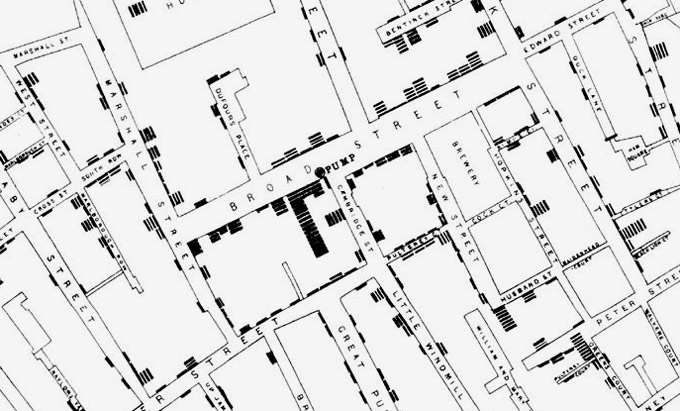</center>

> - Mapa origial de John Snow mostrando los casos de cólera en la epidemia de Londres de 1854. La bomba de agua contaminada estaba ubicada en la esquina de Broad Street y Cambridge Street.


---
## Visualizaciones históricas

<center></center>

> - Considerado como una de los mejores gráficas de la historia, realizado por Charles Joseph Minard muestra la campaña de Napoleón hacia Rusia en 1812.

---
## Tipos de visualizaciones

<center></center>

> - Pueden clasificarse según qué es lo que hacen o muestran. Por ejemplo: Comparaciones, Relaciones, Jerarquías, Ubicaciones, Distribuciones, Movimiento o Flujo, Patrones, Datos en el tiempo, Análisis de texto, etc.

> - Es importante preguntarse entonces `¿Qué es lo que quiero mostrar con mi visualización?`

---
## Tipos de visualizaciones
### Comparaciones

<center>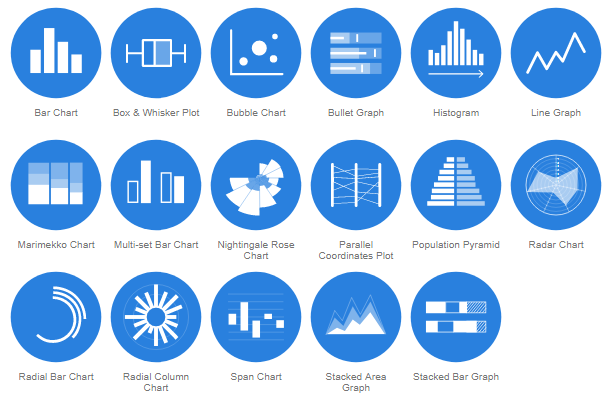</center>

---
## Tipos de visualizaciones
### Relaciones

<center>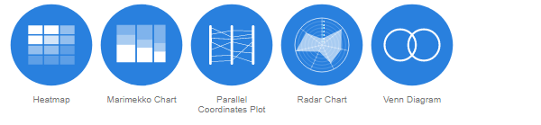</center>
<center></center>
<center></center>

---
## Tipos de visualizaciones
### Jerarquías

<center></center>

### Ubicaciones

<center>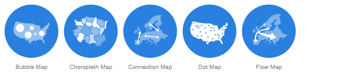</center>

---
## Tipos de visualizaciones
### Distribuciones

<center>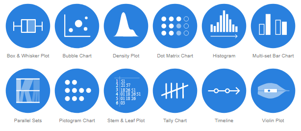</center>

---
## Tipos de visualizaciones (Patrones)

<center></center>

---
## Tipos de visualizaciones
### Datos en el tiempo

<center>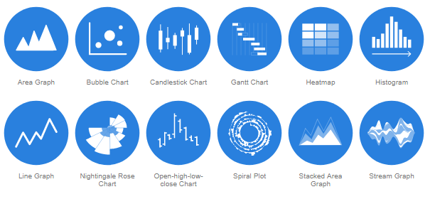</center>
<center></center>


---
## Tipos de visualizaciones
### Movimiento o flujo

<center></center>

### Análisis de texto

<center></center>


---
## El proceso de visualización

> - 1) El tipo de dato y qué se desea expresar

> - 2) Preprocesar los datos (si se requiere más)

> - 3) Definir un mapeo de los datos: cómo se representará cada variable (ejes, color, tamaño, forma, etc.)

> - 4) Proveer controles interactivos (si se requiere)

---
## Consideraciones de percepción humana
### Color

> - La paleta de colores dependerá del tipo de dato: categóricos rankeados o no, binarios, numéricos discretos o continuos.

> - ¿Se pueden ordenar los datos de menor a mayor? <center>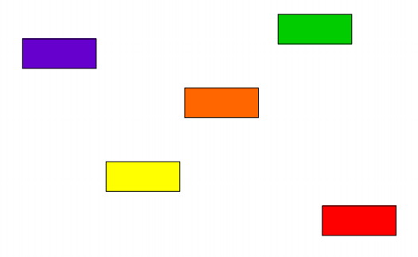</center>

---
## Color

<center>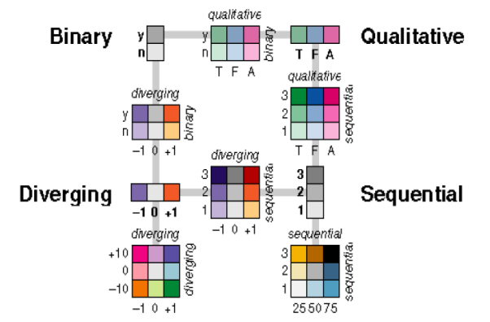</center>

---
## Color

¿Cuántos colores distintos puede apreciar? <center></center>

> - Tiene 22 colores!

---
## Color

Se pueden distinguir adecuadamente entre 8 a 14 colores, dependiendo del tamaño de los objetos, el color de fondo, la saturación, etc. 

<center></center>

---
## Tamaño y formas

> - La recomendación general más encontrada en el mundo de la visualización de datos es la de no utilizar gráficos 3D para barras, tortas o cualquier otro tipo de gráfico 2D que no tenga necesidad de agregarle una dimensión.

> - Adicionalmente, se sugiere no utilizar gráficos de tortas (tampoco 2D) para efectos comparativos de valores absolutos que no sean superficies

> - En ambos casos se altera la correcta percepción de los valores ya que las áreas más grandes son percibidas más grandes de los que son en comparación de las más pequeñas, y viceversa.

--- 
## Recursos

> - Libro "[Interactive data visualization](http://www.idvbook.com)"
> - [R Graphics Cookbook](http://www.cookbook-r.com/Graphs/)
> - Sitio web [Color Brewer](http://colorbrewer2.org)
> - [R graph gallery](https://www.r-graph-gallery.com)
> - Libro "The hitchiker's guide to ggplot2 in R"
> - [R Color Cheat Sheet](https://www.nceas.ucsb.edu/~frazier/RSpatialGuides/colorPaletteCheatsheet.pdf)


--- .segue bg:blue
## Visualización de datos en R

--- 
## Sistema base: pairs


```r
# Función para armar múltiples scatterplots para variables numéricas
pairs(movies[, 2:6])
```


--- 
## Sistema base: histogram


```r
# Función para histogramas de variables numéricas
hist(movies$rating, breaks=seq(0, 10, 0.2))
```


--- 
## Sistema base: barplot


```r
# Función para barras de variables numéricas
barplot(height=median_rating_year$rating, names.arg=median_rating_year$year)
```


> - Ejemplo 19: Calcular cantidad de clasificaciones por cada equipo en dataset de Conmebol y graficar barras en orden de mayor a menor.

--- 
## Sistema base: boxplot


```r
# Función para boxplot de variables numéricas
conmebol <- read.csv('clasif_conmebol_9814.csv', stringsAsFactors=F)
conmebol$Dif. <- conmebol$GF - conmebol$GC
boxplot(as.numeric(Dif.) ~ Equipo, data=conmebol)
```


> - Ejemplo 20: Hacer boxplot para la duración de cada Género de películas

--- 
## Sistema base: scatterplot


```r
# Función para scatterplot de variables numéricas
plot(x=conmebol$GF, y=conmebol$Pts, pch=19, col='red', main='Goles a favor vs Puntos', 
     xlab='Goles a favor', ylab='Puntos')
```

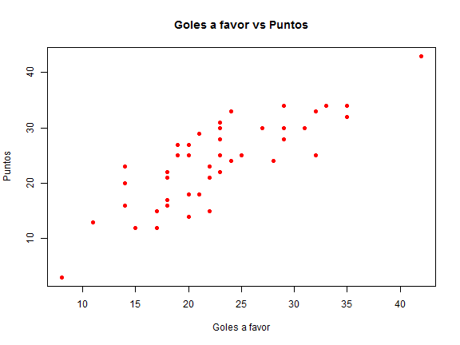

---
## ggplot2

<center></center>

> - Librería creada por Hadley Wickham. Permite construir la mayoría de los tipos de gráficos, de manera eficiente, con consideraciones estéticas y `mucha flexibilidad`.

> - Es muy usada dentro de la comunidad y por lo tanto está en constante desarrollo y tiene un montón de extensiones.

> - Para usarla adecuadamente lo ideal es que tus datos sean parte de un dataframe y cumplan con el concepto Tidy data.

> - Utiliza una sintaxis "aditiva" en la cual se van sumando elementos asociados a distintas partes del gráfico.

---
## ggplot2: Barras


```r
library(ggplot2)
ggplot(median_rating_year, aes(x=year, y=rating)) + 
geom_bar(stat='identity', fill='darkblue')
```

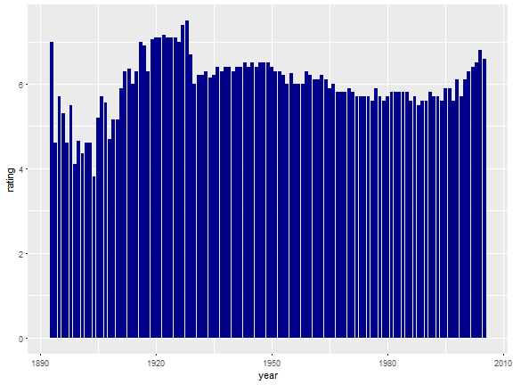

---
## ggplot2: Barras


```r
ggplot(movies, aes(x=year)) + geom_bar(stat='count', fill='red') +
theme_bw() + xlab("Year") + ylab("Amount of movies") +
ggtitle("Amount of movies per year")
```

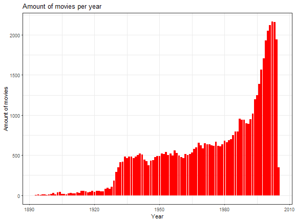

---
## ggplot2: Boxplot


```r
ggplot(conmebol, aes(x=Equipo, y=Pts)) + geom_boxplot() + 
labs(y='Puntos') + theme_bw() + 
theme(axis.text.x = element_text(angle = 90, hjust = 1)) +
ggtitle('Boxplot de puntos obtenidos por equipo')
```


---
## ggplot2: Scatterplot

```r
ggplot(conmebol, aes(x=GF, y=Pts)) + 
geom_point(aes(col=as.factor(Equipo), size=as.numeric(Dif.))) + 
labs(x='Goles a favor', y='Puntos obtenidos', color='Equipo', size='Dif. goles') + 
theme_bw() + scale_colour_brewer(palette = 'Paired')
```


---
## más elementos en ggplot2

> - `geom_text` para agregar anotaciones dentro del gráfico. `ggrepel` para que "no se pisen"

> - `coord_flip` para girar en 90° las barras

> - `scale_y_continuous(breaks=...)` o `scale_x_discrete(limit=..., labels=...)` para editar ejes

> - `theme(legend.position="none")` para ocultar leyenda

> - `facets` para separar en facetas

---
## otros geoms y detalles en ggplot2

> - [`geom_alluvium`](https://cran.r-project.org/web/packages/ggalluvial/vignettes/ggalluvial.html) para diagramas de flujo

> - [`geom_tile`](https://learnr.wordpress.com/2010/01/26/ggplot2-quick-heatmap-plotting/) para heatmaps de matrices

> - librerías complementarias `gridExtra` o `cowplot` para ordenar múltiples gráficos en uno

> - librería complementaria [`ggjoy`](https://cran.r-project.org/web/packages/ggjoy/vignettes/gallery.html) para densidades de distribución múltiples

> - [Cheat sheet de ggplot2](https://www.rstudio.com/wp-content/uploads/2016/12/ggplot2-cheatsheet-2.1-Spanish.pdf)

---
## Otras librerías

> - [plotly](https://plot.ly/r/)

> - [googlevis](https://cran.r-project.org/web/packages/googleVis/vignettes/googleVis_examples.html) (sugerencia: probar la función gvisSankey)

> - [visNetwork](https://cran.r-project.org/web/packages/visNetwork/vignettes/Introduction-to-visNetwork.html)

> - Mapas con [Leaflet](https://rstudio.github.io/leaflet/)

> - [Wordclouds](https://rpubs.com/brandonkopp/creating-word-clouds-in-r)

--- .segue bg:black
## Ejemplos

--- &twocol w1:50% w2:50%
*** =left
> - <center></center>
> - <center></center>

*** =right
> - <center></center>
> - <center></center>

--- &twocol w1:50% w2:50%

*** =left
> - <center>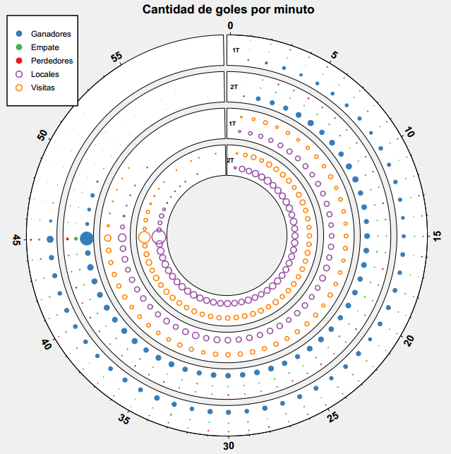</center>

*** =right
> - <center></center>
> - <center>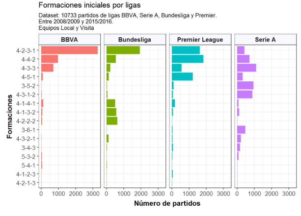</center>

--- &twocol w1:50% w2:50%

*** =left
> - <center></center>
> - <center></center>

*** =right
> - <center>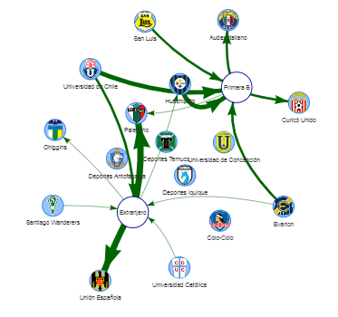</center>
> - <center>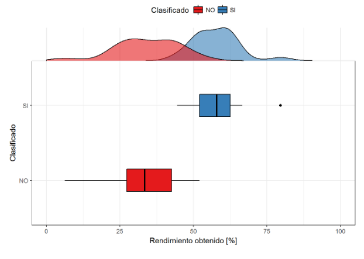</center>

--- &twocol w1:50% w2:50%

*** =left
> - <center>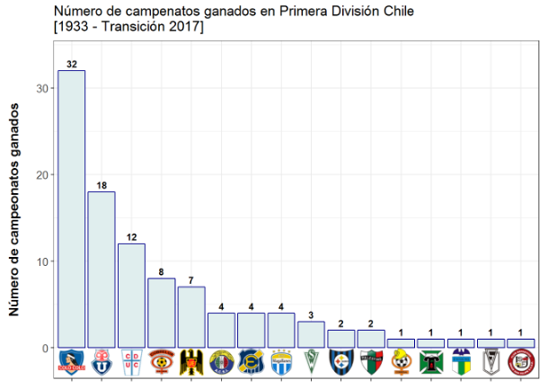</center>
> - <center>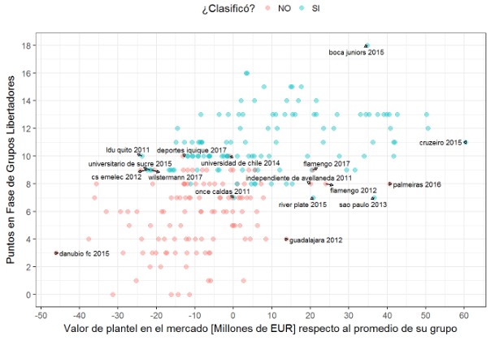</center>

*** =right
> - <center>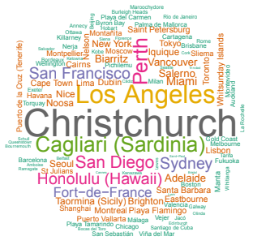</center>
> - <center>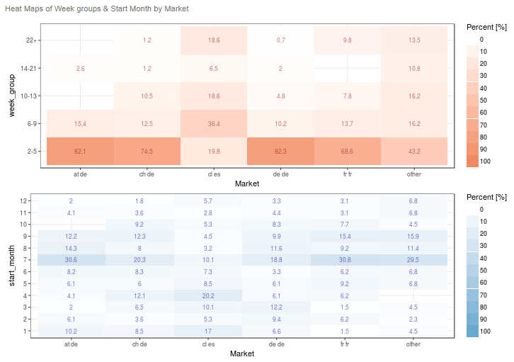</center>


