<style>
.title-slide {
  background-color: white; 
}

.title-slide hgroup > h1{
 font-family: 'Oswald', 'Helvetica', sanserif; 
}

.title-slide hgroup > h1{
  color: black;
}

.title-slide hgroup > h2 {
  color: #3182bd;
}

.title-slide hgroup > p {
  color: #2b323f;
}


</style>


## Contenido de Sesión 4 - Parte I
  
<center>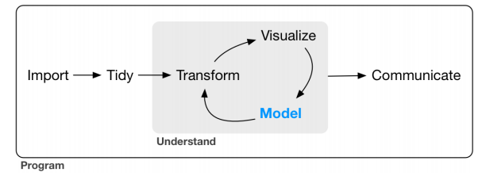</center>

> - Tipos de problemas y métodos principales aplicados

> - Ejemplos de Regresión lineal y Árbol de Decisión (rpart2) en R

> - Nociones de Clustering y Reglas de Asociación

> - Conceptos generales y consideraciones


--- .segue bg:#756bb1
## Modelamiento de datos

---
## Modelamiento de datos

> - ¿Qué voy a modelar?

> - ¿Cuál es el `problema` o la `necesidad`? ¿Cuál es la `pregunta`?

> - Hay dos grandes tipos de problemas dependiendo de si tengo o no ejemplos etiquetados de mi respuesta o salida: 1) `Aprendizaje Supervisado` y 2) `Aprendizaje No Supervisado`

> - Dentro del supervisado tenemos métodos del tipo Regresión y Clasificador, mientras que para el no supervisado se tiene los métodos de Clustering y Reglas de Asociación

---
<center>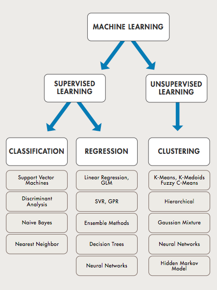</center>

---
<center></center>

--- 
## ¿Qué modelo usar?

> - Ningún modelo es mejor que otro apriori. Dependerá del problema y del dataset disponible

> - Siempre hay un trade off entre Precisión e Interpretabilidad

> - Elegir el modelo puede ser una de las tareas más desafiantes en la práctica

> - No está mal tener como punto de partida el clásico modelo de regresión lineal simple


--- 
## Probabilidades y Distribuciones

`Nos saltaremos la revisión de Probabilidades en virtud del tiempo`

> - Estudiar probabilidades desde la perspectiva `Frecuentista` y `Bayesiana`

> - Tener en cuenta estas funciones en R: <center>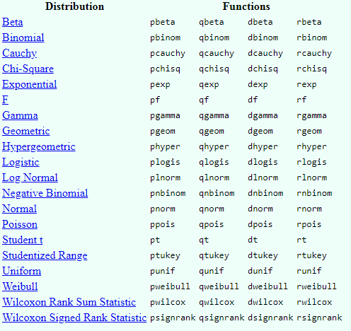</center>

> - Estudiar Estadística Inferencial

--- 
## Regresión lineal simple 

> - Busca estimar los coeficientes beta0 y beta1 de la siguiente expresión: <center>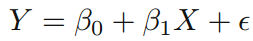</center>
Donde Y representa la estimación de la salida y X la variable de entrada utilizada como predictor. El término `e` corresponde al error íntrinseco al problema que no puede ser explicado por el modelo.

> - Lo hace minimizando el error cuadrático de los residuales (RSS) mediante el `método de los mínimos cuadrados`. La diferencia entre el modelo y el valor real se denominada `residual`

> - <center>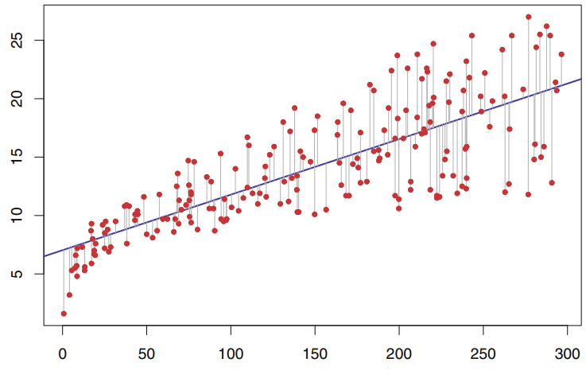</center>

---
## Regresión lineal simple en R
```{r message=F, warning=F, results='markup'}
dataRV <- read.csv('ruido_viento_ok.csv', stringsAsFactors=F)
fit1 <- lm(Leq_RF ~ as.numeric(Viento), dataRV)    # Para ajustar un modelo de regresión lineal
fit1$coefficients
```

---
```{r message=F, warning=F}
library(ggplot2)
ggplot(data=dataRV, aes(x=Viento, y=Leq_RF)) + geom_point() + theme_bw() + 
        geom_smooth(method=lm, se=T) + xlab( 'Viento [m/s]' ) + ylab('Ruido [Leq dBA]')
```

---
```{r message=F, warning=F}
summary(fit1)
```

---
## p-value

> - Sgnificancia estadística de los coeficientes estimados
<center>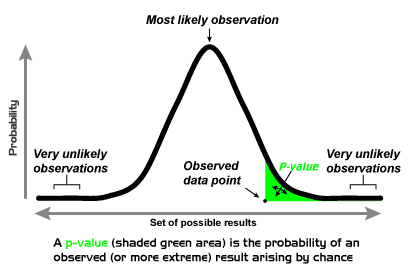</center>

---
<center>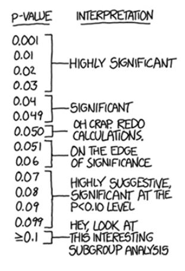</center>

--- &twocol w1:50% w2:50%
*** =left
<center>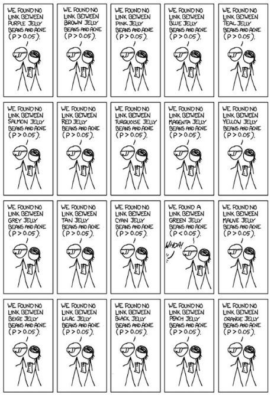</center>

*** =right
<center>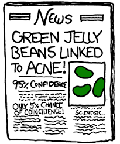</center>

---
## R^2

> - ¿Qué proporción de variabilidad total es explicada por el modelo?: "¿qué tan bueno es el modelo?"
<center></center>

---
<center>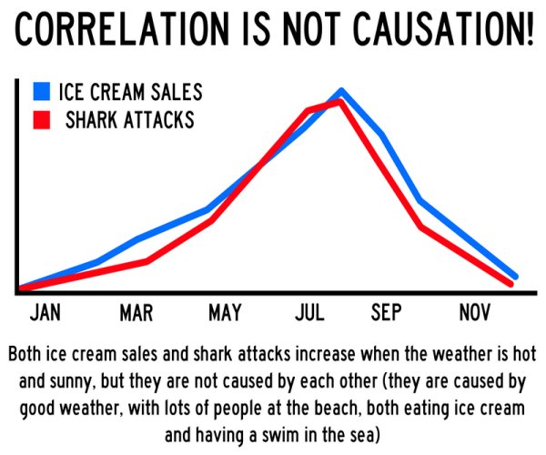</center>

---
<center>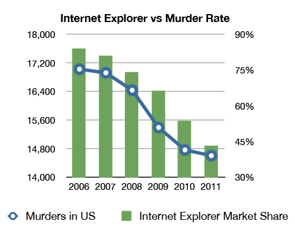</center>

---
<center>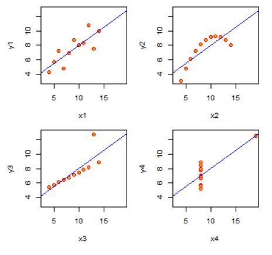</center>


---
## Ejemplo con otro dataset
```{r message=F, warning=F}
#install.packages('MASS')
library(MASS)
#names(Boston)
# ?Boston
fit2 <- lm(medv ~ lstat, Boston)
coef(fit2)
confint(fit2)
```

---
## Predicción
```{r message=F, warning=F, fig.height=5, fig.width=5}
plot(Boston$lstat, Boston$medv); abline(fit2, col='red', lwd=3)
abline(confint(fit2)[1, 1], confint(fit2)[2, 1], col='blue', lwd=2)
abline(confint(fit2)[1, 2], confint(fit2)[2, 2], col='blue', lwd=2)
p <- predict(fit2, newdata=data.frame(lstat=20), interval="prediction")
points(20, p[1], col='darkgreen', lwd=6); points(20, p[2], col='darkgreen', lwd=6)
points(20, p[3], col='darkgreen', lwd=6)
```

---
## Regresión lineal multivariable

<center>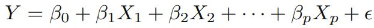</center>

```{r message=F, warning=F, fig.height=5, fig.width=5, size = "small"}
fit3 <- lm(medv ~ lstat + age, Boston)
# summary(fit3)
fit4 <- lm(medv ~ ., Boston)
# summary(fit4)
```

> - Ejemplo 21: Graficar las dos rectas definidas por los coeficientes del modelo fit3 (como el gráfico anterior pero con la nueva información que aporta la variable Age)

---
## Consideraciones

> - F statistics

> - Función `vif()` de librería `car` para análisis de variance inflation (colinealidad entre variables)

> - Función `stepAIC()` de librería `MASS` para variable selector

> - Ver el efecto sinergia (interacción) entre predictores

> - Tener en cuenta que se asume: linealidad, error con distribución gaussiana y estimadores no sesgados.

> - R2 siempre crece al aumentar predictores

> - [Paradoja de Simpsons](https://es.wikipedia.org/wiki/Paradoja_de_Simpson)

> - Outliers, Leverage, Heteroestadicity.
 
---

--- .segue bg:#756bb1
## Conceptos generales de Clasificación

---
## Conceptos generales de Clasificación

> - Particionamiento: Training, Validation & Testing datasets. <center>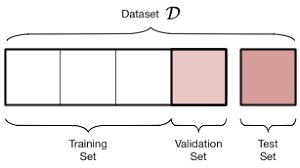</center>

> - Overfitting

> - Cross validation. <center>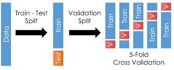</center>

---
## Confusion Matrix (Accuracy, Recall, F Measure)

<center></center>

---
## Curva ROC

<center>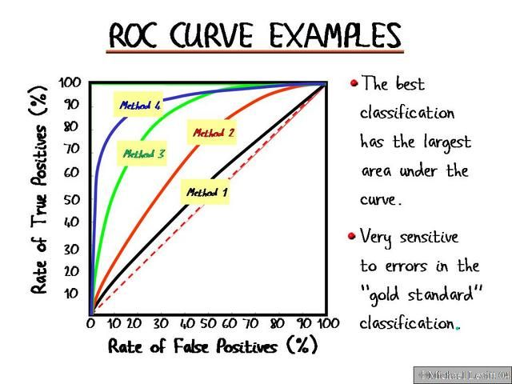</center>

---
## Esquema general

<center>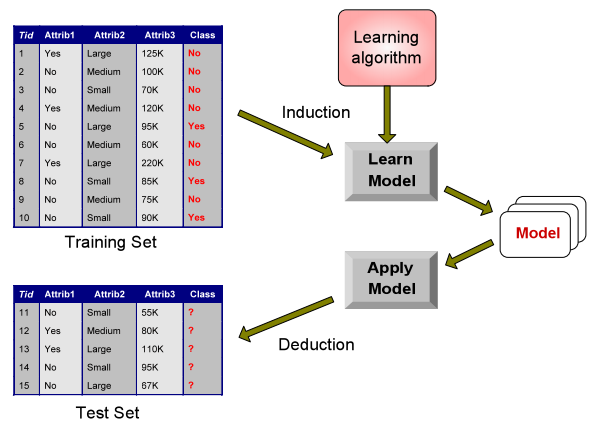</center>

---
## Árbol de decisión (clasificación)

<a href="http://graphics8.nytimes.com/images/2008/04/16/us/0416-nat-subOBAMA.jpg"><center>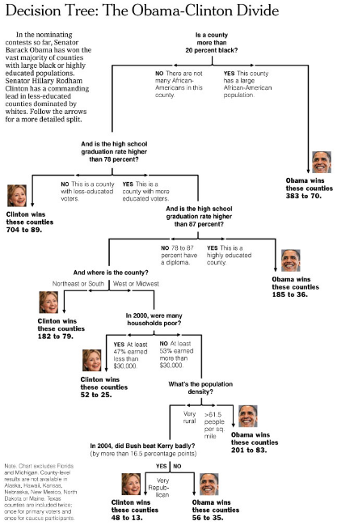</center></a>

---
## Árbol de decisión (clasificación)

> - Separación de variables en grupos mediante un proceso iterativo

> - Evalúa la "homogeneidad" dentro de cada grupo

> - Ventajas: Fácil de interpretar + Buena performance para problemas no lineales

> - Desventajas: Puede generar overfitting al no aplicar técnicas como cross validation + Resultados "variables"

---
## Algoritmo básico

> - Empieza con todas las variables en un solo grupo

> - Encuentra la variable que mejor separa las respuestas o salidas

> - Separa los datos en dos grupos en el nodo

> - Dentro de cada grupo vuelve a buscar la mejor vairable que mejor separa las salidas      

> - Continúa hasta que los grupos son lo suficientemente "pequeños" o "puros"

> - Algunas medidas de impureza utilizadas: Error de clasificación, índice de Gini, Ganancia de infrmación/desviación

---
## Librería `caret` para machine learning en R

```{r message=F, warning=F, fig.height=5, fig.width=5}
titanic <- read.csv('titanic-kaggle.csv', stringsAsFactors=F)
names(titanic)
#install.packages('caret')
library(caret)
data <- titanic[complete.cases(titanic[, c(2:3, 5:8, 10, 12)]), c(2:3, 5:8, 10, 12)]
inTrain = createDataPartition(data$Survived, p = 8/10)[[1]]
training = data[ inTrain,]
testing = data[-inTrain,]
```

---
## Entrenamiento con método `rpart2`

```{r message=F, warning=F, fig.height=5, fig.width=5}
table(training$Survived); summary(training)
```

---
```{r message=F, warning=F, fig.height=5, fig.width=5}
set.seed(2018)
modelFit <- train(factor(Survived) ~ ., data=training, 
                  method="rpart2", trControl=trainControl(method='cv'))
modelFit
#print(modelFit$finalModel)
```

---
## Visualización del árbol

```{r message=F, warning=F, fig.height=5, fig.width=5}
plot(modelFit$finalModel, uniform=TRUE, main="Classification Tree")
text(modelFit$finalModel, use.n=TRUE, all=TRUE, cex=.8)
```

---
## Visualización del árbol

```{r message=F, warning=F, fig.height=5, fig.width=5}
#install.packages('rattle')
library(rattle)
fancyRpartPlot(modelFit$finalModel)
```

---
## Testing

```{r message=F, warning=F, fig.height=5, fig.width=5}
pred <- predict(modelFit, newdata=testing)
confusionMatrix(pred, factor(testing$Survived), positive='1')
```

---

[Un ejemplo de los preprocesos que se pueden mejorar](https://www.kaggle.com/sinakhorami/titanic-best-working-classifier?scriptVersionId=566580)


---
## Clustering

> - Dijimos que era parte de aprendizaje no supervisado. Pero, ¿Cuándo se usa?

> - Cuando necesitamos dividir nuestros datos para formar grupos útiles o significativos (data class identification, outliers or noise detection, data reduction)

> - Cuando queremos conocer o comprobar la estructura natural de los datos (data understanding)

> - A veces es solo un punto de partida

---
## Principales métodos de Clustering

> - K means <center>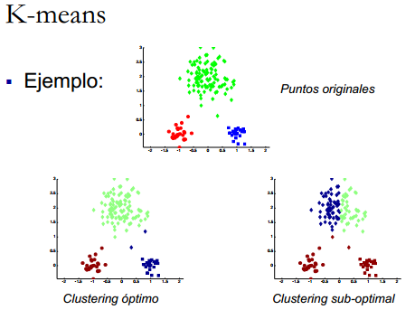</center>

> - Función `kmeans` 

---
## Principales métodos de Clustering

> - Hierarchichal <center>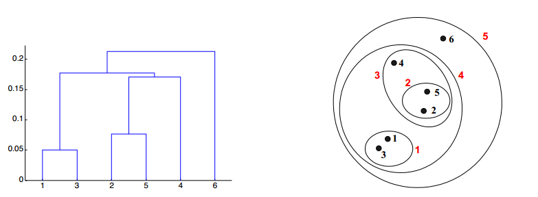</center> <center>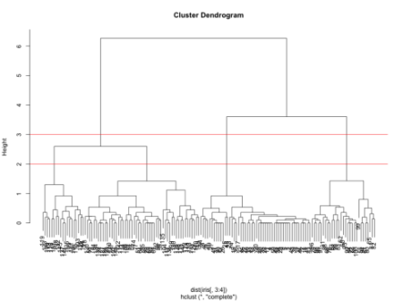</center>

> - Función `hclust` 

---
## Reglas de Asociación

> - <center>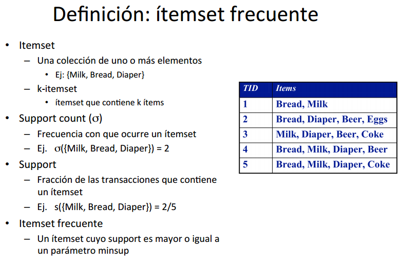</center>

> - Librerías `arules` y `arulesViz`

---
## Reglas de Asociación

<center>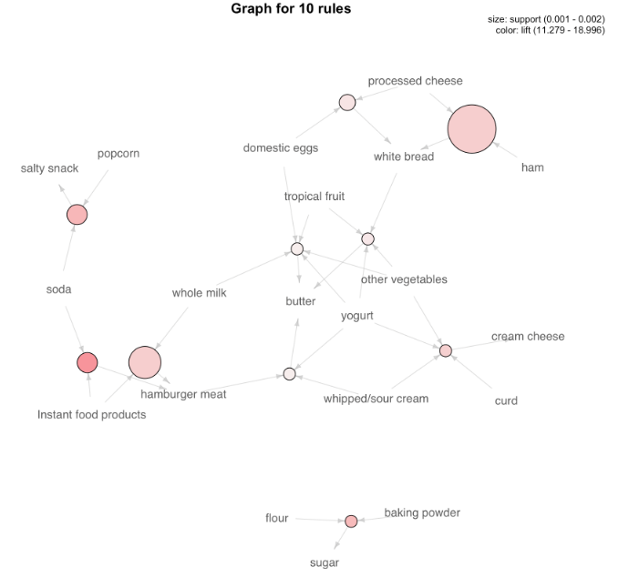</center>


