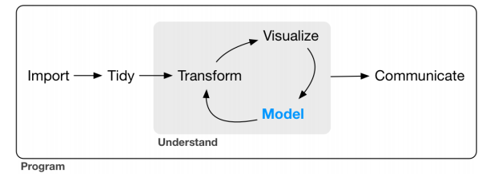
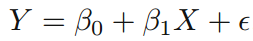
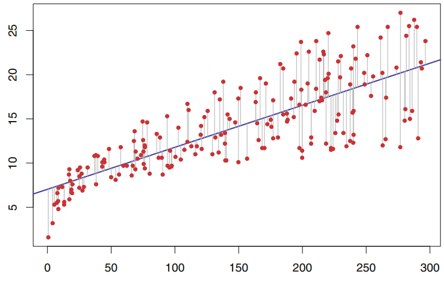
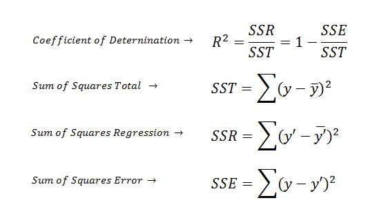
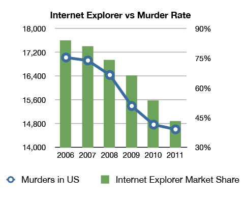
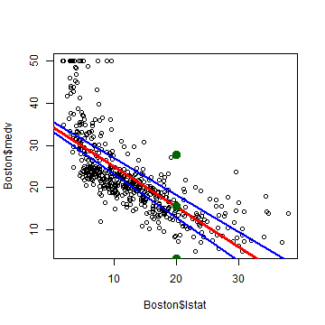
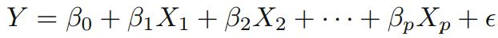
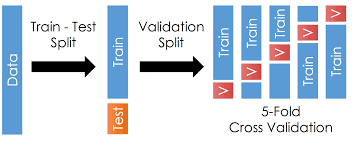
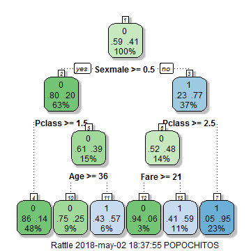
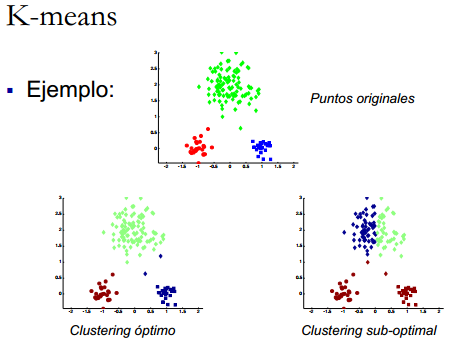

<style>
.title-slide {
  background-color: white; 
}

.title-slide hgroup > h1{
 font-family: 'Oswald', 'Helvetica', sanserif; 
}

.title-slide hgroup > h1{
  color: black;
}

.title-slide hgroup > h2 {
  color: #3182bd;
}

.title-slide hgroup > p {
  color: #2b323f;
}


</style>


## Contenido de Sesión 4 - Parte I
  
<center></center>

> - Tipos de problemas y métodos principales aplicados

> - Ejemplos de Regresión lineal y Árbol de Decisión (rpart2) en R

> - Nociones de Clustering y Reglas de Asociación

> - Conceptos generales y consideraciones


--- .segue bg:#756bb1
## Modelamiento de datos

---
## Modelamiento de datos

> - ¿Qué voy a modelar?

> - ¿Cuál es el `problema` o la `necesidad`? ¿Cuál es la `pregunta`?

> - Hay dos grandes tipos de problemas dependiendo de si tengo o no ejemplos etiquetados de mi respuesta o salida: 1) `Aprendizaje Supervisado` y 2) `Aprendizaje No Supervisado`

> - Dentro del supervisado tenemos métodos del tipo Regresión y Clasificador, mientras que para el no supervisado se tiene los métodos de Clustering y Reglas de Asociación

---
<center></center>

---
<center></center>

--- 
## ¿Qué modelo usar?

> - Ningún modelo es mejor que otro apriori. Dependerá del problema y del dataset disponible

> - Siempre hay un trade off entre Precisión e Interpretabilidad

> - Elegir el modelo puede ser una de las tareas más desafiantes en la práctica

> - No está mal tener como punto de partida el clásico modelo de regresión lineal simple


--- 
## Probabilidades y Distribuciones

`Nos saltaremos la revisión de Probabilidades en virtud del tiempo`

> - Estudiar probabilidades desde la perspectiva `Frecuentista` y `Bayesiana`

> - Tener en cuenta estas funciones en R: <center></center>

> - Estudiar Estadística Inferencial

--- 
## Regresión lineal simple 

> - Busca estimar los coeficientes beta0 y beta1 de la siguiente expresión: <center></center>
Donde Y representa la estimación de la salida y X la variable de entrada utilizada como predictor. El término `e` corresponde al error íntrinseco al problema que no puede ser explicado por el modelo.

> - Lo hace minimizando el error cuadrático de los residuales (RSS) mediante el `método de los mínimos cuadrados`. La diferencia entre el modelo y el valor real se denominada `residual`

> - <center></center>

---
## Regresión lineal simple en R

```r
dataRV <- read.csv('ruido_viento_ok.csv', stringsAsFactors=F)
fit1 <- lm(Leq_RF ~ as.numeric(Viento), dataRV)    # Para ajustar un modelo de regresión lineal
fit1$coefficients
```

```
##        (Intercept) as.numeric(Viento) 
##           40.26626            2.38093
```

---

```r
library(ggplot2)
ggplot(data=dataRV, aes(x=Viento, y=Leq_RF)) + geom_point() + theme_bw() + 
        geom_smooth(method=lm, se=T) + xlab( 'Viento [m/s]' ) + ylab('Ruido [Leq dBA]')
```


---

```r
summary(fit1)
```

```
## 
## Call:
## lm(formula = Leq_RF ~ as.numeric(Viento), data = dataRV)
## 
## Residuals:
##      Min       1Q   Median       3Q      Max 
## -10.9805  -3.9662   0.1076   3.7314  14.1766 
## 
## Coefficients:
##                    Estimate Std. Error t value Pr(>|t|)    
## (Intercept)          40.266      1.645  24.483  < 2e-16 ***
## as.numeric(Viento)    2.381      0.545   4.369  2.7e-05 ***
## ---
## Signif. codes:  0 '***' 0.001 '**' 0.01 '*' 0.05 '.' 0.1 ' ' 1
## 
## Residual standard error: 5.548 on 118 degrees of freedom
## Multiple R-squared:  0.1392,	Adjusted R-squared:  0.1319 
## F-statistic: 19.09 on 1 and 118 DF,  p-value: 2.7e-05
```

---
## p-value

> - Sgnificancia estadística de los coeficientes estimados
<center></center>

---
<center></center>

--- &twocol w1:50% w2:50%
*** =left
<center></center>

*** =right
<center></center>

---
## R^2

> - ¿Qué proporción de variabilidad total es explicada por el modelo?: "¿qué tan bueno es el modelo?"
<center></center>

---
<center></center>

---
<center></center>

---
<center></center>


---
## Ejemplo con otro dataset

```r
#install.packages('MASS')
library(MASS)
#names(Boston)
# ?Boston
fit2 <- lm(medv ~ lstat, Boston)
coef(fit2)
```

```
## (Intercept)       lstat 
##  34.5538409  -0.9500494
```

```r
confint(fit2)
```

```
##                 2.5 %     97.5 %
## (Intercept) 33.448457 35.6592247
## lstat       -1.026148 -0.8739505
```

---
## Predicción

```r
plot(Boston$lstat, Boston$medv); abline(fit2, col='red', lwd=3)
abline(confint(fit2)[1, 1], confint(fit2)[2, 1], col='blue', lwd=2)
abline(confint(fit2)[1, 2], confint(fit2)[2, 2], col='blue', lwd=2)
p <- predict(fit2, newdata=data.frame(lstat=20), interval="prediction")
points(20, p[1], col='darkgreen', lwd=6); points(20, p[2], col='darkgreen', lwd=6)
points(20, p[3], col='darkgreen', lwd=6)
```



---
## Regresión lineal multivariable

<center></center>


```r
fit3 <- lm(medv ~ lstat + age, Boston)
# summary(fit3)
fit4 <- lm(medv ~ ., Boston)
# summary(fit4)
```

> - Ejemplo 21: Graficar las dos rectas definidas por los coeficientes del modelo fit3 (como el gráfico anterior pero con la nueva información que aporta la variable Age)

---
## Consideraciones

> - F statistics

> - Función `vif()` de librería `car` para análisis de variance inflation (colinealidad entre variables)

> - Función `stepAIC()` de librería `MASS` para variable selector

> - Ver el efecto sinergia (interacción) entre predictores

> - Tener en cuenta que se asume: linealidad, error con distribución gaussiana y estimadores no sesgados.

> - R2 siempre crece al aumentar predictores

> - [Paradoja de Simpsons](https://es.wikipedia.org/wiki/Paradoja_de_Simpson)

> - Outliers, Leverage, Heteroestadicity.
 
---

--- .segue bg:#756bb1
## Conceptos generales de Clasificación

---
## Conceptos generales de Clasificación

> - Particionamiento: Training, Validation & Testing datasets. <center></center>

> - Overfitting

> - Cross validation. <center></center>

---
## Confusion Matrix (Accuracy, Recall, F Measure)

<center></center>

---
## Curva ROC

<center></center>

---
## Esquema general

<center></center>

---
## Árbol de decisión (clasificación)

<a href="http://graphics8.nytimes.com/images/2008/04/16/us/0416-nat-subOBAMA.jpg"><center></center></a>

---
## Árbol de decisión (clasificación)

> - Separación de variables en grupos mediante un proceso iterativo

> - Evalúa la "homogeneidad" dentro de cada grupo

> - Ventajas: Fácil de interpretar + Buena performance para problemas no lineales

> - Desventajas: Puede generar overfitting al no aplicar técnicas como cross validation + Resultados "variables"

---
## Algoritmo básico

> - Empieza con todas las variables en un solo grupo

> - Encuentra la variable que mejor separa las respuestas o salidas

> - Separa los datos en dos grupos en el nodo

> - Dentro de cada grupo vuelve a buscar la mejor vairable que mejor separa las salidas      

> - Continúa hasta que los grupos son lo suficientemente "pequeños" o "puros"

> - Algunas medidas de impureza utilizadas: Error de clasificación, índice de Gini, Ganancia de infrmación/desviación

---
## Librería `caret` para machine learning en R


```r
titanic <- read.csv('titanic-kaggle.csv', stringsAsFactors=F)
names(titanic)
```

```
##  [1] "PassengerId" "Survived"    "Pclass"      "Name"        "Sex"        
##  [6] "Age"         "SibSp"       "Parch"       "Ticket"      "Fare"       
## [11] "Cabin"       "Embarked"
```

```r
#install.packages('caret')
library(caret)
data <- titanic[complete.cases(titanic[, c(2:3, 5:8, 10, 12)]), c(2:3, 5:8, 10, 12)]
inTrain = createDataPartition(data$Survived, p = 8/10)[[1]]
training = data[ inTrain,]
testing = data[-inTrain,]
```

---
## Entrenamiento con método `rpart2`


```r
table(training$Survived); summary(training)
```

```
## 
##   0   1 
## 339 233
```

```
##     Survived          Pclass          Sex                 Age       
##  Min.   :0.0000   Min.   :1.000   Length:572         Min.   : 0.75  
##  1st Qu.:0.0000   1st Qu.:1.000   Class :character   1st Qu.:21.00  
##  Median :0.0000   Median :2.000   Mode  :character   Median :29.00  
##  Mean   :0.4073   Mean   :2.201                      Mean   :30.38  
##  3rd Qu.:1.0000   3rd Qu.:3.000                      3rd Qu.:39.00  
##  Max.   :1.0000   Max.   :3.000                      Max.   :80.00  
##      SibSp            Parch             Fare          Embarked        
##  Min.   :0.0000   Min.   :0.0000   Min.   :  0.00   Length:572        
##  1st Qu.:0.0000   1st Qu.:0.0000   1st Qu.:  8.05   Class :character  
##  Median :0.0000   Median :0.0000   Median : 15.74   Mode  :character  
##  Mean   :0.5122   Mean   :0.4318   Mean   : 35.67                     
##  3rd Qu.:1.0000   3rd Qu.:1.0000   3rd Qu.: 34.87                     
##  Max.   :5.0000   Max.   :6.0000   Max.   :512.33
```

---

```r
set.seed(2018)
modelFit <- train(factor(Survived) ~ ., data=training, 
                  method="rpart2", trControl=trainControl(method='cv'))
modelFit
```

```
## CART 
## 
## 572 samples
##   7 predictor
##   2 classes: '0', '1' 
## 
## No pre-processing
## Resampling: Cross-Validated (10 fold) 
## Summary of sample sizes: 515, 515, 516, 515, 514, 514, ... 
## Resampling results across tuning parameters:
## 
##   maxdepth  Accuracy   Kappa    
##   1         0.7920955  0.5631893
##   3         0.8113333  0.6002531
##   7         0.7918773  0.5625847
## 
## Accuracy was used to select the optimal model using the largest value.
## The final value used for the model was maxdepth = 3.
```

```r
#print(modelFit$finalModel)
```

---
## Visualización del árbol


```r
plot(modelFit$finalModel, uniform=TRUE, main="Classification Tree")
text(modelFit$finalModel, use.n=TRUE, all=TRUE, cex=.8)
```


---
## Visualización del árbol


```r
#install.packages('rattle')
library(rattle)
fancyRpartPlot(modelFit$finalModel)
```



---
## Testing


```r
pred <- predict(modelFit, newdata=testing)
confusionMatrix(pred, factor(testing$Survived), positive='1')
```

```
## Confusion Matrix and Statistics
## 
##           Reference
## Prediction  0  1
##          0 72 22
##          1 13 35
##                                           
##                Accuracy : 0.7535          
##                  95% CI : (0.6742, 0.8219)
##     No Information Rate : 0.5986          
##     P-Value [Acc > NIR] : 7.596e-05       
##                                           
##                   Kappa : 0.4734          
##  Mcnemar's Test P-Value : 0.1763          
##                                           
##             Sensitivity : 0.6140          
##             Specificity : 0.8471          
##          Pos Pred Value : 0.7292          
##          Neg Pred Value : 0.7660          
##              Prevalence : 0.4014          
##          Detection Rate : 0.2465          
##    Detection Prevalence : 0.3380          
##       Balanced Accuracy : 0.7305          
##                                           
##        'Positive' Class : 1               
## 
```

---

[Un ejemplo de los preprocesos que se pueden mejorar](https://www.kaggle.com/sinakhorami/titanic-best-working-classifier?scriptVersionId=566580)


---
## Clustering

> - Dijimos que era parte de aprendizaje no supervisado. Pero, ¿Cuándo se usa?

> - Cuando necesitamos dividir nuestros datos para formar grupos útiles o significativos (data class identification, outliers or noise detection, data reduction)

> - Cuando queremos conocer o comprobar la estructura natural de los datos (data understanding)

> - A veces es solo un punto de partida

---
## Principales métodos de Clustering

> - K means <center></center>

> - Función `kmeans` 

---
## Principales métodos de Clustering

> - Hierarchichal <center></center> <center></center>

> - Función `hclust` 

---
## Reglas de Asociación

> - <center></center>

> - Librerías `arules` y `arulesViz`

---
## Reglas de Asociación

<center></center>


