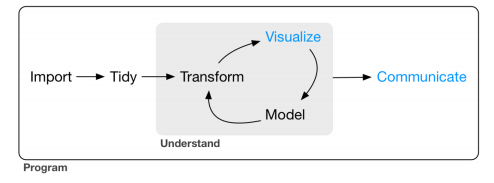
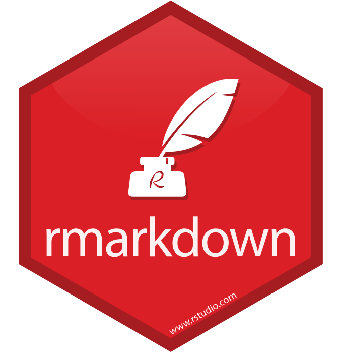
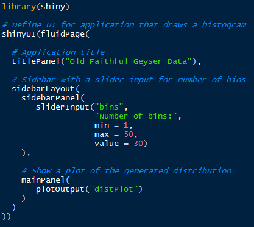
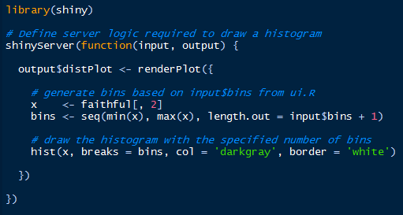

## Contenido de Sesión 4 - Parte II
  

> - R Markdown, librería `knitr` y R notebooks

> - Shiny

> - Google Data Studio

> - Otras herramientas

---
## R Markdown

> - Librería que permite crear y dar formato a documentos de texto como HTML, PDF, Word, etc.

> - No es necesario instalarla ([viene con R Studio](https://rmarkdown.rstudio.com)), pero sí se requiere la librería `knitr` para compilar.

> - Es parte del proceso que incluye la comunicación de resultados, el trabajo colaborativo, la reproducibilidad y "hacer ciencia de datos" con los notebooks.

> - Con esto es posible incluir texto, código, imágenes, gráficos, etc.

> - El archivo base tiene extensión `.Rmd` (todos los slides del taller están hechos con R markdown)

---
## Pasos básicos

> - 1) Crear nuevo archivo "R Markdown..." con extensión .Rmd para HTML y guardarlo

> - 2) Instalar y cargar la librería `knitr`

> - 3) Presionar botón "Knit"

---
## Sugerencias a revisar

> - La sintaxis, configuración y detalles principales se encuentran en este [Cheat Sheet](https://github.com/rstudio/cheatsheets/raw/master/rmarkdown-2.0.pdf)

> - Para exportar a PDF instalar [MikTEX](https://miktex.org/download) (en Windows)

> - Librerías `slidify` y `revealjs` para creación de slides o presentaciones

> - La diferencia con R Notebook es que este permite ejecutar código "in situ" y previsualizar resultados (no es ncesario "knitear" el documento completo)

--- .segue bg:#2b8cbe
## Shiny

---
## 

> - Librería que permite levantar aplicaciones interactivas desde R Studio, ya sea de manera local como en servidor remoto.

> - Busca reducir la dificultad de programación. No es necesario tener habilidades de desarrollo web.

> - Apunta a la comunicación de resultados y a la experiencia del usuario final, por lo tanto contempla aspectos técnicos (archivo o parte `server.R`), de usabilidad y estética (archivo o parte `ui.R`).

--- &twocol w1:50% w2:50%
## ui y server

*** =left
> - 

*** =right
> - 

 

---
## Pasos básicos

> - 1) Es necesario instalar y cargar la librería `shiny`.

> - 2) Crear nuevo(s) archivo(s) "Shiny Web App..." con la opción "Multiple File", dándole nombre a la app y en una nueva carpeta dentro del work directory (wd)

> - 3) Abrir cualquiera de los dos archivos (server o ui) y presionar "Run App"

---
## Sugerencias a revisar

> - [Cheat Sheet](https://github.com/rstudio/cheatsheets/raw/master/shiny.pdf)

> - Para publicar en servidor remoto de manera gratuita (con limitaciones), crear una cuenta en [shinyapps.io](http://www.shinyapps.io) y usar la librería `devtools` para deploy.

> - Para usar [templates tipo dashboards](http://rstudio.github.io/shinydashboard/)

--- .segue bg:#2b8cbe
## Google Data Studio

---
## [Google Data Studio](https://datastudio.google.com/navigation/reporting)

> - Herramienta de Google que permite crear y compartir dashboards personalizados.

> - Solo basta crear una cuenta con un correo electrónico asociado

> - Es gratuito

> - Permite conectar datos de Analytics, Adwords, Youtube, Facebook, Search Console, entre otros.

> - Además permite importar bases de datos (MySQL, PostgreSQL), archivos CSV, etc.

---
## Otras herramientas

> - Librería `blogdown` (creación de sitios web estáticos desde R Studio)

> - Github (control de versiones, trabajo colaborativo, repositorio, reproducibilidad, open data, etc.)

> - Power BI

> - Tableau

> - Twitter!

--- bg:white

